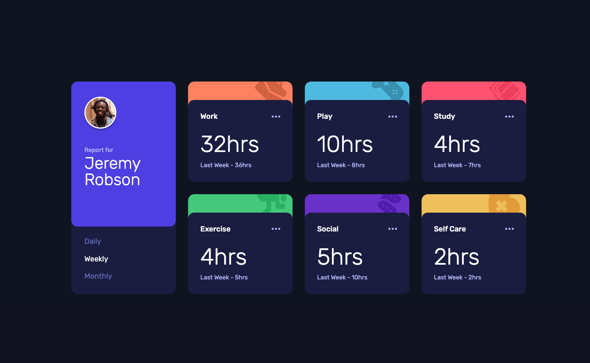

# Frontend Mentor - Time tracking dashboard solution

This is a solution to the [Time tracking dashboard challenge on Frontend Mentor](https://www.frontendmentor.io/challenges/time-tracking-dashboard-UIQ7167Jw). Frontend Mentor challenges help you improve your coding skills by building realistic projects.

## Table of contents

- [Overview](#overview)
  - [The challenge](#the-challenge)
  - [Screenshot](#screenshot)
  - [Links](#links)
- [My process](#my-process)
  - [Built with](#built-with)
  - [What I learned](#what-i-learned)
  - [Continued development](#continued-development)
  - [Useful resources](#useful-resources)
- [Author](#author)

## Overview

### The challenge

Users should be able to:

- View the optimal layout for the site depending on their device's screen size
- See hover states for all interactive elements on the page
- Switch between viewing Daily, Weekly, and Monthly stats

### Screenshot

### Links

- Solution URL: [Add solution URL here](https://your-solution-url.com)
- Live Site URL: [Here](https://your-live-site-url.com)

## My process

### Built with

- Semantic HTML5 markup
- SASS/SCSS
- Flexbox
- CSS Grid
- Mobile-first workflow

### What I learned

This challenge was a good refresher on manipulating the DOM with JavaScript and I learned more about implementing accessible tabbed interfaces.

### Continued development

I look forward to continued learning and building upon my JavaScript and CSS or SASS skills.

### Useful resources

- [Tabbed Interfaces](https://inclusive-components.design/tabbed-interfaces/) - This helped me implement a proper tabbed interface.

## Author

- Portfolio - [Nate Valline](https://natevalline.dev)
- Frontend Mentor - [@nvalline](https://www.frontendmentor.io/profile/nvalline)
- LinkedIn - [Nate Valline](https://www.linkedin.com/in/nvalline)
